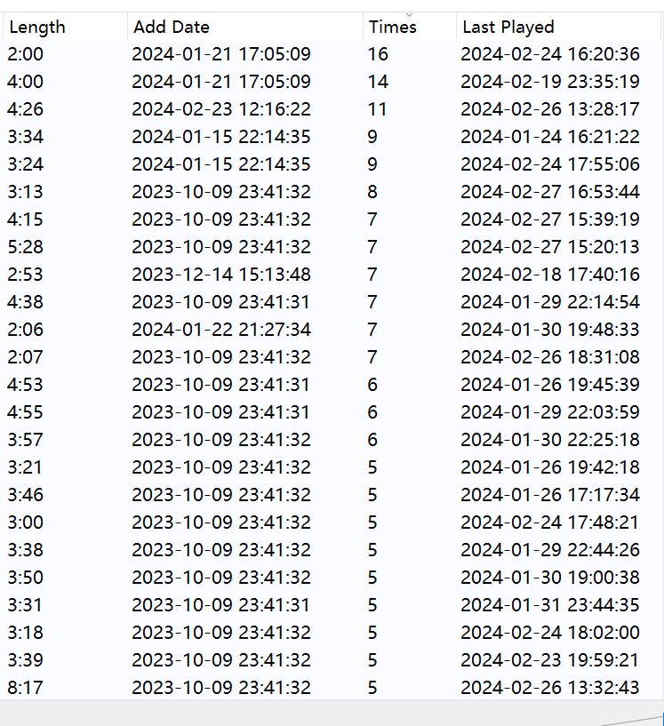

# 算法
<!-- - [ ] spectral_bandwidth->spectral_centroids->bpm->spectral_flatness->spectral_contrast的权值顺序调整 -->
- [ ] 特征提取：使用spectral_bandwidth，spectral_contrast，bpm，和节选部分频谱。librosa库
- [ ] 相似度算法
- [ ] 相似度算法调参（
- [ ] 数据存储设计
# 程序
- [x] 内核
- [ ] 前端部分，qml，qss
- [ ] pyqt
- [ ] 实现播放少的歌曲随机播放时播放可能性更大